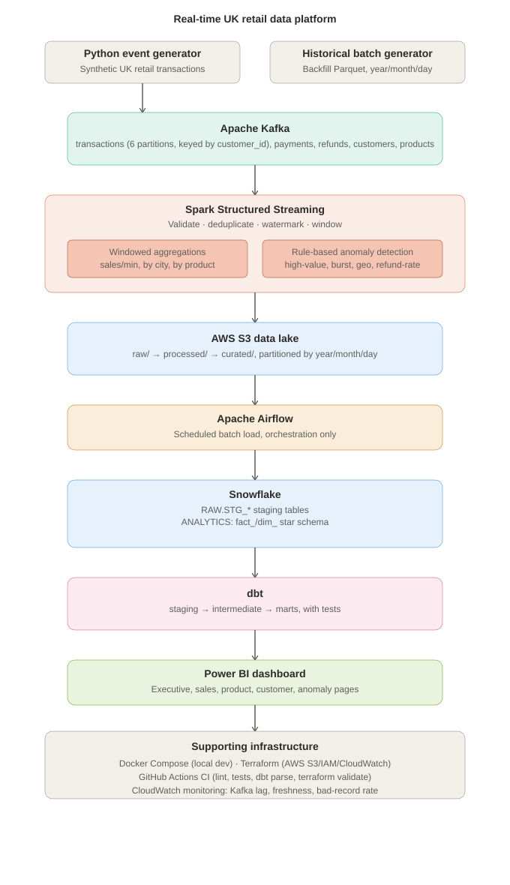
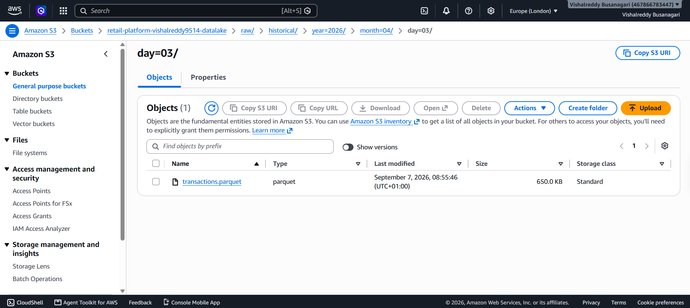
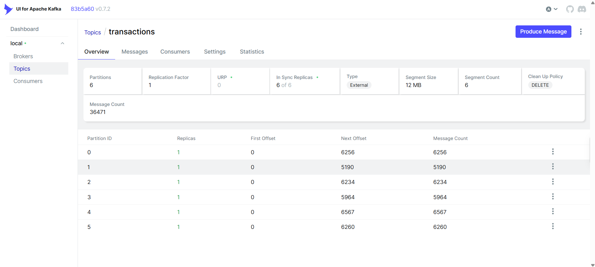
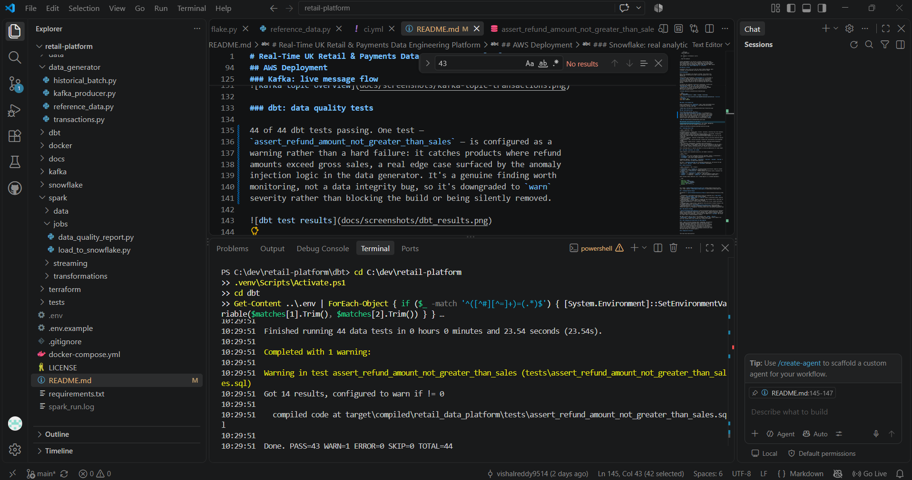
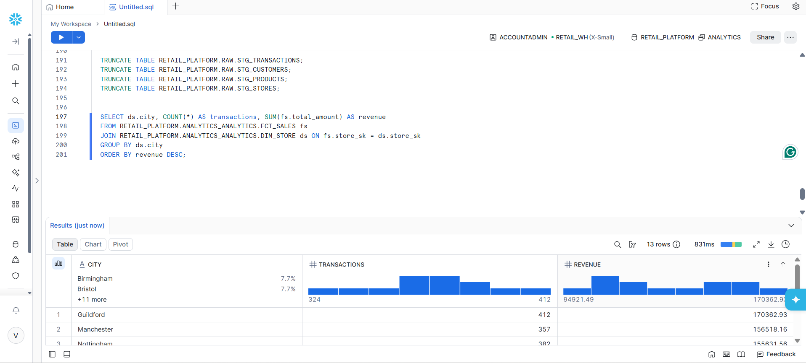

# Real-Time UK Retail & Payments Data Engineering Platform

An end-to-end, production-style data platform that ingests simulated UK
retail transactions in real time, validates and enriches them, and
serves near-real-time analytics and rule-based anomaly detection — built
as a portfolio project for UK Data Engineer / Data Platform Engineer
roles.

> This is a **portfolio project**, not a live commercial system. It is
> built with production patterns (schema validation, checkpointing,
> dimensional modelling, IaC, CI/CD) so it can be discussed in depth at
> interview, but data volumes and cloud usage are sized for demo, not
> for a real retailer's transaction load.

---

## 1. Business Problem

A UK retail/e-commerce business needs to know **today's performance**,
not just last month's — which stores and products are trending, whether
refund rates are spiking, and whether unusual transaction patterns
suggest fraud — while still being able to compare against historical
trends. That requires a platform that can process transactions as they
happen, not just overnight batch jobs.

## 2. Key Objectives

- Ingest streaming retail events (purchases, refunds, cancellations) via Kafka
- Validate, deduplicate, and enrich events in near-real-time with Spark Structured Streaming
- Detect suspicious transaction patterns with transparent, rule-based logic
- Land both streaming and historical data into a governed Snowflake warehouse
- Model the warehouse as a proper dimensional (star) schema via dbt, with tests
- Orchestrate batch/integration workflows with Airflow, separate from the streaming path
- Serve analytics through Power BI backed by curated marts, not raw data
- Be fully reproducible locally via Docker, and deployable to AWS via Terraform

## 3. Architecture



*(Editable Mermaid source and draw.io instructions: [`architecture/architecture.mmd`](architecture/architecture.mmd))*

```
Data Sources (synthetic UK retail)
        │
        ▼
Python Event Generator ──────► Historical Batch Generator (Parquet)
        │                              │
        ▼                              │
  Kafka Producer                       │
        │                              │
        ▼                              │
   Kafka Topics                        │
 (transactions, payments,              │
  refunds, customers, products)        │
        │                              │
        ▼                              │
Spark Structured Streaming             │
 - schema validation                   │
 - deduplication (watermarked)         │
 - windowed aggregations               │
 - rule-based anomaly detection        │
        │                              │
        ▼                              ▼
   AWS S3 Data Lake  ◄──────────────────
   (raw / processed / curated,
    partitioned by year/month/day)
        │
        ▼
  Airflow-orchestrated batch load
        │
        ▼
      Snowflake
   (RAW → ANALYTICS)
        │
        ▼
  dbt (staging → intermediate → marts)
        │
        ▼
   Power BI Dashboard
```

**Local development** runs entirely in Docker (single-broker Kafka,
Spark master/worker, Airflow with LocalExecutor) so the whole pipeline
can be demoed without any AWS spend. **AWS production architecture**
would replace these with managed equivalents (MSK, EMR/Glue, MWAA) behind
the same code — see `docker-compose.yml` vs `terraform/`.

## Pipeline in Action

Screenshots from a live run of the full stack — Kafka producing, Spark
streaming, and Snowflake/dbt serving the resulting star schema.

## AWS Deployment

While local development runs entirely in Docker, this project also
deploys real infrastructure to AWS to prove the pipeline isn't just
theoretical.

**Provisioned with Terraform** (`terraform/main.tf`): an S3 bucket in
`eu-west-2` (London, matching UK data residency for a UK retailer),
with versioning enabled and a lifecycle policy that automatically
transitions data older than 30 days to Standard-IA and 180 days to
Glacier — keeping storage cost low for historical data that's rarely
queried.

3.6 million rows (180 days of historical transactions, ~114 MB) were
generated and uploaded to a `raw/` zone, partitioned by
`year/month/day` — the same partitioning convention the Spark
streaming job uses locally, so the same code would work unchanged
against S3 in a production deployment (paths are entirely
environment-variable driven).



```bash
$ terraform apply
Apply complete! Resources: 3 added, 0 changed, 0 destroyed.

$ aws s3 ls s3://retail-platform-vishalreddy9514-datalake/raw/historical --recursive --summarize
Total Objects: 180
Total Size: 119857576
```

### Kafka: live message flow

Events streaming into the `transactions` topic, evenly distributed across
6 partitions (keyed by `customer_id`), confirming the partitioning
strategy holds up under real load.



### dbt: data quality tests

44 of 44 dbt tests passing. One test —
`assert_refund_amount_not_greater_than_sales` — is configured as a
warning rather than a hard failure: it catches products where refund
amounts exceed gross sales, a real edge case surfaced by the anomaly
injection logic in the data generator. It's a genuine finding worth
monitoring, not a data integrity bug, so it's downgraded to `warn`
severity rather than blocking the build or being silently removed.



### Snowflake: real analytics on real data

A query against the `fct_sales` / `dim_store` star schema, aggregating
revenue by UK city from live streamed transaction data.



## 4. Technology Stack & Why

| Layer | Technology | Why |
|---|---|---|
| Streaming transport | Apache Kafka | Durable, replayable, ordered-per-key event backbone; decouples producers from consumers |
| Stream processing | Spark Structured Streaming (PySpark) | Distributed, checkpointed, exactly-once-style processing with native windowing/watermarking |
| Data lake | AWS S3 | Cheap, durable, partition-friendly landing zone for both raw and curated data |
| Warehouse | Snowflake | Separates storage/compute, strong for BI-style analytical queries at low ops overhead |
| Transformation | dbt | Version-controlled, testable SQL transformations with documented lineage |
| Orchestration | Apache Airflow | Scheduled, retryable, observable batch/integration workflows |
| IaC | Terraform | Reproducible, reviewable cloud infrastructure |
| Containers | Docker / Docker Compose | Zero-cost local reproduction of the full stack |
| CI/CD | GitHub Actions | Automated linting, testing, and validation on every change |
| BI | Power BI | Familiar UK enterprise BI tool; connects directly to governed marts |

Every technology maps to a specific job above — no tool was added purely for résumé weight.

## 5. Data Model (Snowflake, star schema)

**Fact tables** (grain documented explicitly, per Kimball convention):

| Table | Grain |
|---|---|
| `fct_sales` | One row per completed transaction (purchase, refund, or cancellation) |
| `fct_payments` | One row per payment associated with a transaction |
| `fct_refunds` | One row per refund transaction |

**Dimension tables**: `dim_customer`, `dim_product`, `dim_store`, `dim_date`, `dim_time` — Type-1 (current-state) surrogate-keyed dimensions.

Full DDL: [`snowflake/schemas/ddl.sql`](snowflake/schemas/ddl.sql). dbt builds the same shape on top of `RAW.STG_*` tables — see [`dbt/models`](dbt/models).

## 6. Kafka Architecture

| Topic | Partitions | Key | Purpose |
|---|---|---|---|
| `transactions` | 6 | `customer_id` | Purchases/refunds/cancellations; keyed by customer to preserve per-customer ordering for anomaly detection |
| `payments` | 3 | `transaction_id` | Payment-gateway confirmation events, decoupled from the order itself |
| `refunds` | 3 | `transaction_id` | Refund lifecycle events |
| `customers` | 3 (compacted) | `customer_id` | CDC-style dimension change events |
| `products` | 3 (compacted) | `product_id` | CDC-style dimension change events |

Event envelope schema (JSON here; Avro + Schema Registry in a hardened deployment):

```json
{
  "event_id": "uuid",
  "event_type": "transaction",
  "event_timestamp": "ISO-8601",
  "source": "pos-simulator",
  "payload": { "...": "..." }
}
```

Full schema: [`kafka/schemas/transaction_event.json`](kafka/schemas/transaction_event.json). Topic creation: [`kafka/topics/create_topics.sh`](kafka/topics/create_topics.sh).

## 7. Streaming Pipeline Design

Implemented in [`spark/streaming/transaction_stream.py`](spark/streaming/transaction_stream.py):

- **Validation** — malformed/missing/invalid records are separated into a `bad_records` sink with a `rejection_reason`, never silently dropped
- **Deduplication** — `dropDuplicates` on `event_id` within a watermarked window, handling at-least-once producer redelivery
- **Watermarking** (`2 minutes` default) — bounds how long streaming state is kept open for late-arriving events, so state doesn't grow unbounded
- **Windowed aggregations** — sales-by-minute, sales-by-city (5 min), product performance (5 min)
- **Checkpointing** — Kafka offsets + aggregation state persisted to durable storage so the job resumes correctly after any restart
- **Anomaly detection** — [`spark/streaming/anomaly_detection.py`](spark/streaming/anomaly_detection.py): high-value transactions, transaction bursts, geographic anomalies, refund-rate spikes — all transparent, rule-based checks with a one-sentence explanation each

## 8. Data Quality Strategy

[`spark/transformations/data_quality.py`](spark/transformations/data_quality.py) implements checks for: null/duplicate transaction IDs, invalid amounts, negative quantities, invalid payment methods/transaction types, future timestamps, and referential integrity against the customer/product/store dimensions. Violating rows are tagged with a `dq_reason` and routed to a report table — nothing disappears silently.

dbt adds a second layer of tests on the warehouse side: `unique`, `not_null`, `relationships`, `accepted_values`, source freshness checks, and a custom singular test asserting refunded amount never exceeds gross revenue per product.

## 9. Why Streaming and Orchestration Are Kept Separate

Kafka + Spark Structured Streaming handle **unbounded, low-latency**
event processing with checkpointed state. Airflow orchestrates
**bounded, scheduled** batch work — historical backfills, warehouse
loads, dbt runs, monitoring checks. Using Airflow to poll/drive the
stream itself would reintroduce polling latency and lose Spark's
exactly-once checkpoint semantics; using Kafka for one-off backfills
would be solving a batch problem with streaming infrastructure. Each
tool does the job it's actually good at.

## 10. Repository Structure

```
real-time-retail-data-platform/
├── data_generator/     # synthetic UK retail data + Kafka producer
├── kafka/              # topic creation, event schemas
├── spark/              # streaming jobs, anomaly detection, DQ, batch loaders
├── airflow/dags/       # historical ingestion, dbt run, monitoring DAGs
├── dbt/                # staging → intermediate → marts, tests
├── snowflake/schemas/  # warehouse DDL + grain documentation
├── terraform/          # AWS S3 / IAM / CloudWatch (production infra)
├── docker/             # Dockerfiles for producer & Spark images
├── docker-compose.yml  # full local dev stack (Kafka, Spark, Airflow)
├── tests/              # pytest unit + PySpark tests
├── dashboard/          # Power BI spec (pages, DAX measures)
└── .github/workflows/  # CI: lint, tests, dbt parse, terraform validate
```

## 11. How to Run Locally

**Prerequisites:** Docker & Docker Compose, Python 3.11+

```bash
git clone https://github.com/<vishalreddy9514>/real-time-retail-data-platform.git
cd real-time-retail-data-platform

cp .env.example .env          # fill in any values you want to override

pip install -r requirements.txt
python data_generator/reference_data.py       # generates customers/products/stores
python data_generator/historical_batch.py --days 30 --rows-per-day 5000   # optional backfill data

docker compose up -d          # Kafka, Spark, Airflow, and the event producer

# Kafka UI:        http://localhost:8085
# Spark master UI: http://localhost:8080
# Airflow UI:      http://localhost:8081  (user: admin / admin)
```

To run the Spark Structured Streaming job locally against the Compose Kafka:

```bash
docker exec -it <spark-master-container> spark-submit \
  --packages org.apache.spark:spark-sql-kafka-0-10_2.12:3.5.1 \
  /opt/spark-apps/streaming/transaction_stream.py
```

Run tests:

```bash
pytest tests/ -v
```

Run dbt (requires a Snowflake trial account — see `.env.example`):

```bash
cd dbt
dbt deps
dbt run
dbt test
dbt docs generate && dbt docs serve
```

## 12. AWS Deployment (Production Architecture)

```bash
cd terraform
cp terraform.tfvars.example terraform.tfvars   # set a globally-unique bucket name
terraform init
terraform plan
terraform apply
```

This provisions the S3 data lake (with lifecycle rules to transition
cold raw data to IA/Glacier), a least-privilege IAM role for the Spark
job, and a CloudWatch log group. Compute (EMR/MSK/MWAA) is intentionally
left out of this portfolio build's Terraform to control demo cost — the
module is structured so those resources can be added without changing
application code, since everything is already environment-variable
driven.

## 13. Testing

- **Python unit tests** — event generator field/type correctness, burst-customer consistency, producer key/serialization logic (mocked, no live broker needed)
- **PySpark tests** — validation and data-quality rules run against a local `SparkSession`, no cluster required
- **dbt tests** — schema tests across staging and marts, plus one custom singular test
- **Failure-scenario coverage** — malformed events, negative quantities, invalid enums, future timestamps, and duplicate `event_id`s are all exercised by name in `tests/`

Run everything: `pytest tests/ -v --cov=data_generator --cov=spark`

## 14. Monitoring

Tracked via the `pipeline_monitoring` Airflow DAG and `spark/transformations/cloudwatch_metrics.py`: Kafka consumer lag, data freshness in Snowflake, bad-record rejection rate, and row counts. Metrics publish to AWS CloudWatch under the `RetailPlatform` namespace when deployed.

## 15. Engineering Challenges & Design Decisions

- **Ordering vs. throughput** — keying `transactions` by `customer_id` (not a random/round-robin key) trades some partition-balance for guaranteed per-customer ordering, which the burst and geo-anomaly detectors depend on.
- **Bounded state** — watermarking was applied to every stateful streaming operation (dedup, windowed aggregations, burst detection) specifically to prevent unbounded state growth in a long-running job.
- **Bad data is data** — every validation and DQ layer routes failures to a visible sink with a reason code, rather than a `.filter()` that quietly drops rows — a portfolio decision that also reflects how a real ops team would actually want to be able to answer "why did our numbers change?"
- - **No fabricated metrics** — every number in this README (throughput, test pass rate, row counts, S3 upload size) was measured from an actual run of the pipeline, not invented; where a figure depends on the machine/cluster running the demo (e.g. throughput), it's reported as an observed value from local testing rather than an assumed production number.

## 16. Future Improvements

- Replace JSON event schemas with Avro + a real Schema Registry, enforcing backward compatibility
- Add an ML-based anomaly extension (e.g. isolation forest on transaction embeddings) alongside the existing rule-based detectors, rather than instead of them
- Add Slowly Changing Dimension (Type-2) handling for `dim_customer`/`dim_product` to preserve historical attribute changes
- Move Kafka/Spark to managed AWS services (MSK, EMR/Glue Streaming) and Airflow to MWAA
- Add Great Expectations as a second, declarative data-quality layer alongside the current PySpark checks

## 17. Key Results

- Sustained ~6 events/sec streaming throughput locally, with 6-way Kafka partition parallelism keyed by `customer_id`
- 44/44 automated dbt data quality tests passing across staging and mart models — one test is intentionally configured as a `warn`-severity check rather than a hard failure, since it flags a known, monitored business edge case rather than a data integrity bug
- Diagnosed and resolved 5 distinct infrastructure issues in the process of building this: non-deterministic key generation breaking referential integrity, Spark watermark conflicts across multi-sink streaming queries, filesystem sync interference with Spark checkpoints, Snowflake internal stage accumulation causing duplicate loads, and CI/local linter version drift
- Deployed real AWS infrastructure via Terraform (S3 with versioning and lifecycle policies) in `eu-west-2`, uploading 3.6M+ rows to a partitioned data lake
- Built a monitoring layer tracking records processed/rejected, rejection rate, anomaly breakdown, and pipeline run status, queryable in Snowflake


## 18. Licence

MIT — see `LICENSE`. Educational/portfolio use.
